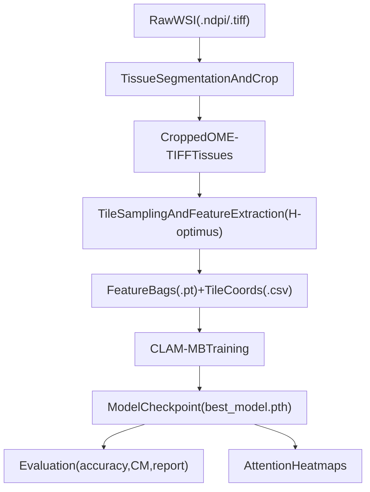

# WSI-Classification

Clinical decision-support pipeline for **whole-slide image (WSI)** analysis of muscle biopsies, designed to help classify slides into clinically relevant categories (including **Myopathic** cases).

## Project Summary

This repository provides an end-to-end workflow for pathology WSIs:

- tissue segmentation and cropping from raw slides
- tile-level feature extraction using a histology foundation model
- weakly supervised classification with CLAM-MB
- model evaluation and attention heatmap visualization

Target classes currently used in this project:
`Healthy`, `Myopathic`, `Dystrophic`, `Inflammatory`, `Neurogenic`.

## End-to-End Workflow



## Key Capabilities

- **WSI preprocessing:** segment tissue regions and export pyramidal OME-TIFF crops.
- **Feature extraction:** generate per-tissue embeddings (`*_features.pt`) and tile coordinates (`*_tiles.csv`).
- **MIL classification:** train CLAM-MB on variable-length tissue bags with attention and clustering regularization.
- **Evaluation outputs:** confusion matrix, classification report, and prediction artifacts.
- **Interpretability:** visualize class-branch and averaged attention maps over tissue regions.
- **Metadata utility:** inject objective magnification (`NominalMagnification`) into OME-TIFF metadata.

## Repository Structure

- `segmentation/` - Tissue detection, crop export, and OME magnification utility.
- `feature_extraction/` - Tile dataset and embedding inference pipeline.
- `clam/` - Dataset, CLAM model, training, evaluation, and attention visualization.
- `notebooks/` - Model usage and exploratory notebook scripts (jupytext format).
- `presentation/` - Slide deck material.
- `environment.yml` - Conda environment definition.
- `.devcontainer/` - Containerized development setup.

## Quick Start

### 1) Environment Setup

From repository root:

```bash
conda env create -f environment.yml
conda activate wsi-env
```

If you use the devcontainer, dependencies are defined in:
`.devcontainer/Dockerfile` and `.devcontainer/requirements.txt`.

### 2) Prepare Data

The scripts assume local data under:
`/workspaces/WSI-Classification/data/HE-MYO/`

Expected processed structure for CLAM:

```text
data/HE-MYO/Processed/
  Healthy/
    slide_A/
      tissue_001.ome.tiff
      tissue_001_tiles.csv
      tissue_001_features.pt
  Myopathic/
    slide_B/
      tissue_002.ome.tiff
      tissue_002_tiles.csv
      tissue_002_features.pt
  Dystrophic/
  Inflammatory/
  Neurogenic/
```

### 3) Run the Pipeline

From repository root:

```bash
# (A) Tissue preprocessing / cropping
python segmentation/crop_tissues_multislides.py

# (B) Feature extraction on processed tissues
python feature_extraction/inference.py

# (C) Train CLAM-MB classifier
python clam/train_clam.py

# (D) Evaluate trained model
python clam/evaluate_clam.py

# (E) Generate attention heatmaps
python clam/visualize_attention.py
```

Optional utility to add/update OME magnification metadata:

```bash
python segmentation/add_ome_magnification.py \
  --input /path/to/tissue.ome.tiff \
  --magnification 20 \
  --output /path/to/tissue.with_mag.ome.tiff
```

## Configuration

- Main CLAM configuration: `clam/config.yml`
- Default model/data settings in code currently use project-local absolute paths.
- Before running on a new machine, update path values in scripts/config as needed.

## Outputs

Typical generated artifacts include:

- `*_features.pt` - per-tile feature embeddings per tissue
- `*_tiles.csv` - tile center coordinates
- `checkpoints/best_model.pth` - best training checkpoint
- evaluation reports and confusion matrices under the configured results directory
- attention heatmaps under the configured visualization output directory

## Intended Use and Disclaimer

This software is intended for **research and decision-support workflows** in computational pathology. It is **not** a certified medical device and must **not** be used as a standalone diagnostic system. Any clinical or translational use requires independent validation, expert pathology oversight, and compliance with applicable regulations (for example, data-protection and medical-device requirements).

## Contributing

Contributions that improve reproducibility, path configurability, and clinical interpretability are welcome. Please open an issue or pull request with a clear description of the problem and proposed change.
